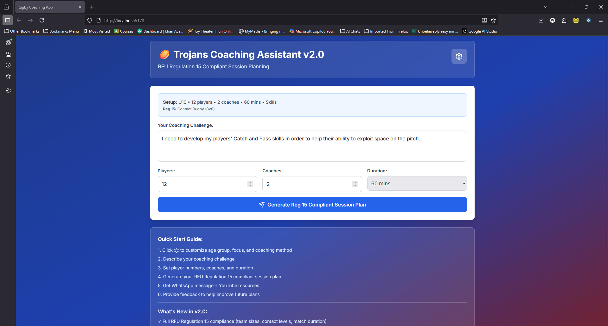
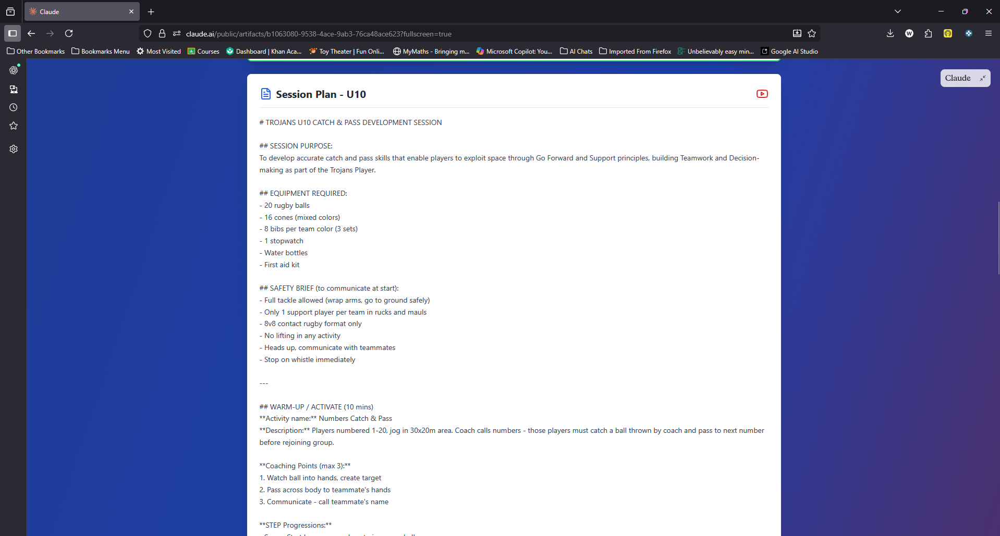
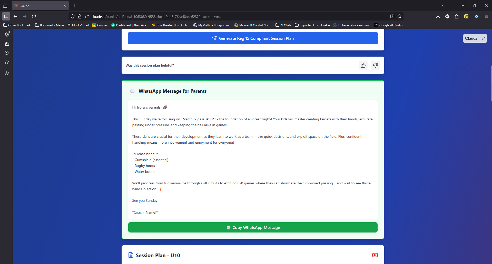

# 🏉 Trojans Coaching Assistant

AI-powered rugby coaching session planner for Trojans RFC - RFU Regulation 15 compliant.

## Overview

The Trojans Coaching Assistant helps rugby coaches at Trojans RFC quickly generate comprehensive, age-appropriate training session plans that follow the club's coaching framework and comply with RFU Regulation 15.

### Key Features

- ✅ **RFU Regulation 15 Compliant** - Automatically adjusts team sizes, contact levels, and match duration for each age group (U6-U18)
- ✅ **Trojans Framework Integration** - Embeds club coaching habits, TREDS values, and the Trojans Player development model
- ✅ **Multiple Coaching Methods** - Game Zone/Skill Zone, Freeze Frame, Block Practice, Decision Making Activities
- ✅ **Age-Appropriate Activities** - Tag rugby for U7-U8, transitional contact for U9, full contact progressions for U10+
- ✅ **STEP Principle Progressions** - Space, Task, Equipment, People variations built into every activity
- ✅ **YouTube Resources** - Suggestions for Keep Your Boots On and RFU Kids First videos
- ✅ **WhatsApp Summaries** - Auto-generated parent-friendly session descriptions
- ✅ **Feedback System** - Track which session plans coaches find most useful

## Screenshots





## Tech Stack

- **Frontend:** React 18 + TypeScript
- **Styling:** Tailwind CSS
- **Icons:** Lucide React
- **AI:** Claude Sonnet 4.5 (Anthropic API)
- **Build Tool:** Vite
- **Deployment:** Replit (development) / TBD (production)

## Getting Started

### Prerequisites

- Node.js 18+ and npm
- Git
- Anthropic API key (for deployment)

### Local Development

1. **Clone the repository**
```bash
   git clone https://github.com/footnote42/trojans-coaching-assistant.git
   cd trojans-coaching-assistant
```

2. **Navigate to client directory**
```bash
   cd client
```

3. **Install dependencies**
```bash
   npm install
```

4. **Start development (two options)**

- Frontend-only (fast UI dev with Vite):
```powershell
cd client
npm run dev
```
Opens the Vite dev server (default port `5173`). Use this when iterating only on React components or styles.

- Full app (recommended for end-to-end testing — API proxy + Vite middleware):
```powershell
# from repository root
npm start
```
This runs the Express server (`server/index.ts`) which integrates Vite in dev mode; it serves the API and the client together (default port `5000`). Use this to exercise `/api/generate` and server-side behavior.

5. **Open in browser**

- Frontend-only: `http://localhost:5173`
- Full app (server): `http://localhost:5000`

### Note on API Access

The Claude API integration requires an Anthropic API key. During development/testing, the application can be accessed via the [Claude.ai shared artifact link](https://claude.ai/public/artifacts/b1063080-9538-4ace-9ab3-76ca48ace623) which provides free API access.

For production deployment with your own API key, environment variables need to be configured (documentation coming soon).

### Developer Notes (env & safety)

- Server-side API key: set `ANTHROPIC_API_KEY` in your server environment. The backend proxy endpoint `/api/generate` (see `server/routes.ts`) uses this key — do not commit or expose it.

- Optional local dev key: `client/src/lib/api-key-storage.ts` will read `import.meta.env.VITE_ANTHROPIC_API_KEY` if present. This is only for development convenience; production uses the server proxy.

- Database: if you enable DB features, set `DATABASE_URL` (Neon/Postgres) and follow `shared/schema.ts` for schema changes.

- Ports: `PORT` env var overrides the default `5000` used by the server.

## How It Works

1. **Select age group** (U6-U18) and session parameters
2. **Describe your coaching challenge** (e.g., "Players struggle with support play in attack")
3. **Generate session plan** - Claude creates a complete plan including:
   - Session purpose aligned to Trojans Framework
   - Equipment list
   - Safety brief
   - Progressive activities (warm-up, skill zones, game zones, cool down)
   - Coaching organization notes
   - Review questions
   - Regulation 15 compliance check
   - YouTube resource suggestions
4. **Copy and use** - WhatsApp summary for parents, full plan for coaches

## RFU Regulation 15 Compliance

The assistant enforces correct rules for each age group:

| Age Group | Format | Team Size | Contact Level |
|-----------|--------|-----------|---------------|
| U7-U8 | Tag Rugby | 4v4 / 6v6 | No contact |
| U9 | Transitional Contact | 7v7 | Tackle including hold |
| U10 | Contact Rugby | 8v8 | Full tackle, 1 support at breakdown |
| U11 | Contact Rugby | 9v9 | Full tackle, 2 support at breakdown |
| U12+ | Contact Rugby | 12v12 / 15v15 | Progressive full contact |

## Trojans Coaching Framework

All session plans incorporate:

- **TREDS Values:** Teamwork, Respect, Enjoyment, Discipline, Sportsmanship
- **Trojans Coaching Habits:** Shared Purpose, Progression, Praise, Review, Choice
- **The Trojans Player:** Development of Behaviours, Skills, and Knowledge
- **RFU Principles of Play:** Go Forward, Support, Continuity, Pressure, Contest
- **APES Sessions:** Active, Purposeful, Enjoyable, Safe

## Roadmap

See [Issues](https://github.com/footnote42/trojans-coaching-assistant/issues) for planned features and known bugs.

**Upcoming:**
- [ ] Individual section regeneration (#3)
- [ ] Trojans helmet logo (#2)
- [ ] UI/UX improvements (#4)
- [ ] Session history/save feature
- [ ] Export to PDF
- [ ] Multi-week programme planning

## Contributing

This is currently a Trojans RFC internal project. If you're a Trojans coach interested in contributing or providing feedback, please contact the development team.

## License

*[To be determined - likely internal use only for Trojans RFC]*

## Acknowledgments

- **Trojans RFC** - For the coaching framework and club ethos
- **RFU** - For Regulation 15 and age grade guidelines
- **Anthropic** - For Claude AI capabilities
- **Tim Dancer & Sully** - Club Coaching Coordinators providing feedback
- **All Trojans volunteer coaches** - Who inspired this tool

## Contact

**Project Maintainer:** Wayne Ellis  
**Club:** Trojans RFC, Southampton  
**Website:** [trojansrugby.co.uk](https://www.trojansrugby.co.uk)

---

**#ProudToBeATrojan** 🏉
